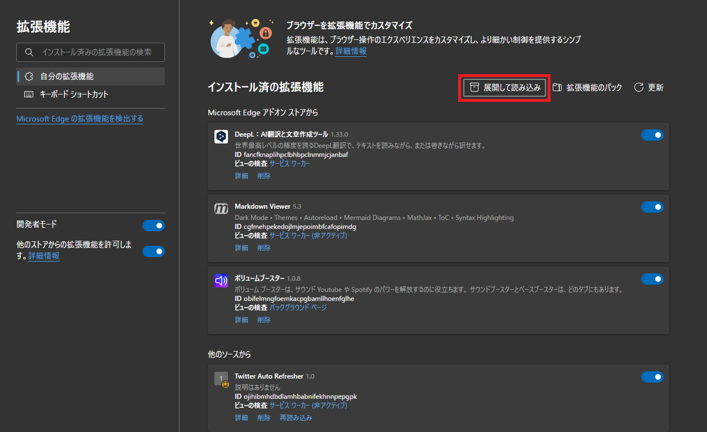
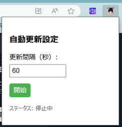

# twitter-auto-reload
Twitter（現X）のタブのホームボタンを一定間隔で押してリロードする。ついでに広告も消す
steamでゲームしながら勝手にTwitterのタブが更新されて欲しかったので作った

# USAGE
```
git clone https://github.com/O-taxi/twitter-auto-reload.git
```
- Edgeの拡張機能のページを開き、展開して読み込みをクリック

- クローンしたリポジトリのフォルダを選択して有効化
- 拡張機能選択で`Twitter Auto Refresher`をクリックして更新間隔を設定して開始ボタンをクリック  

  
# NOTE
急造なのでゴミもたくさん残ってるし汚いしちゃんと動作確認できていないところもある  
アイコン画像は128x128サイズの画像を適当に用意して入れ替えて
## 環境
Edgeで動作確認。おそらくChromiumベースのブラウザであれば使える
## 仕様
- 日本語環境で動作確認しているため、多言語設定の場合は書き換えが必要
- 複数タブ・ウィンドウで開いている場合最初に開いたもののみで適用されるため注意
    - デバッグ時複数開いていて全然動かなかったのでバグかと思ったら忘れ去られたバックグラウンドのウィンドウで動いていた
    - 開いているすべてのタブで動作するようにしても良かったがなんとなく嫌だったので辞めた
- BOT判定によるBANが怖いので更新間隔に±20%のランダム性を付与するようにしている
## ログ
- 自動更新が実行されるたびに実行された時間が出力される
- 消された広告ツイートの本文が出力される
    - テスト動作時は1回削除されると全然広告が出て来なかったため継続的に削除がちゃんと動いているかは要確認
## 直したい
- 自動更新が実行中でも、拡張機能のポップアップを出すとデフォルトで停止中と表示されてしまう
- なんかいろいろ